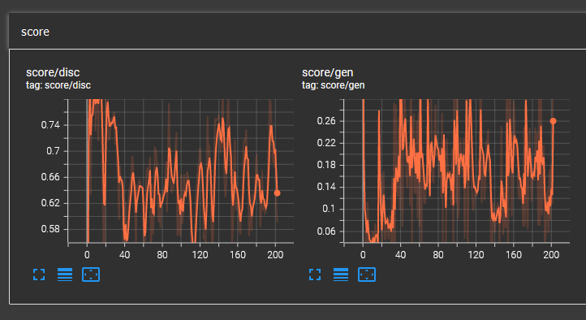

# Flowers GAN

Training a [DCGAN](https://arxiv.org/abs/1511.06434) to resemble [tf_flowers](https://www.tensorflow.org/datasets/catalog/tf_flowers) dataset. It is an implementation of the architecture that is used in [Matlab help](https://www.mathworks.com/help/deeplearning/ug/train-generative-adversarial-network.html) in TensorFlow. It is based on the DCGAN implementation tutorial on [TensorFlow website](https://www.tensorflow.org/tutorials/generative/dcgan).

[](https://colab.research.google.com/github/radinshayanfar/gan-tf-flowers/blob/master/dcgan.ipynb)

The generator creates 64x64 pixels flower images.


You can also checkout the [outputs during training](./images/training) or watch how the outputs evolved to resemble flowers in [this huge GIF](./images/dcgan.gif) file (may take some time to load).

## Model Architecture

The generator and discriminator networks are based on [this experiment](https://www.mathworks.com/help/deeplearning/ug/train-generative-adversarial-network.html). Models details are as follows:

```python
In [1] : generator.summary()
Out [1]: Model: "sequential"
         _________________________________________________________________
          Layer (type)                Output Shape              Param #   
         =================================================================
          dense (Dense)               (None, 8192)              827392    

          reshape (Reshape)           (None, 4, 4, 512)         0         

          conv2d_transpose (Conv2DTra  (None, 8, 8, 256)        3277056   
          nspose)                                                         

          batch_normalization (BatchN  (None, 8, 8, 256)        1024      
          ormalization)                                                   

          re_lu (ReLU)                (None, 8, 8, 256)         0         

          conv2d_transpose_1 (Conv2DT  (None, 16, 16, 128)      819328    
          ranspose)                                                       

          batch_normalization_1 (Batc  (None, 16, 16, 128)      512       
          hNormalization)                                                 

          re_lu_1 (ReLU)              (None, 16, 16, 128)       0         

          conv2d_transpose_2 (Conv2DT  (None, 32, 32, 64)       204864    
          ranspose)                                                       

          batch_normalization_2 (Batc  (None, 32, 32, 64)       256       
          hNormalization)                                                 

          re_lu_2 (ReLU)              (None, 32, 32, 64)        0         

          conv2d_transpose_3 (Conv2DT  (None, 64, 64, 3)        4803      
          ranspose)                                                       

         =================================================================
         Total params: 5,135,235
         Trainable params: 5,134,339
         Non-trainable params: 896
         _________________________________________________________________
```

```python
In [2] : discriminator.summary()
Out [2]: Model: "sequential"
         _________________________________________________________________
          Layer (type)                Output Shape              Param #   
         =================================================================
          random_flip (RandomFlip)    (None, 64, 64, 3)         0         

          dropout (Dropout)           (None, 64, 64, 3)         0         

          conv2d (Conv2D)             (None, 32, 32, 64)        4864      

          leaky_re_lu (LeakyReLU)     (None, 32, 32, 64)        0         

          conv2d_1 (Conv2D)           (None, 16, 16, 64)        409664    

          batch_normalization_3 (Batc  (None, 16, 16, 64)       256       
          hNormalization)                                                 

          leaky_re_lu_1 (LeakyReLU)   (None, 16, 16, 64)        0         

          conv2d_2 (Conv2D)           (None, 8, 8, 64)          1638464   

          batch_normalization_4 (Batc  (None, 8, 8, 64)         256       
          hNormalization)                                                 

          leaky_re_lu_2 (LeakyReLU)   (None, 8, 8, 64)          0         

          conv2d_3 (Conv2D)           (None, 4, 4, 64)          6553664   

          batch_normalization_5 (Batc  (None, 4, 4, 64)         256       
          hNormalization)                                                 

          leaky_re_lu_3 (LeakyReLU)   (None, 4, 4, 64)          0         

          conv2d_4 (Conv2D)           (None, 2, 2, 1)           1025      

          flatten (Flatten)           (None, 4)                 0         

          dense_1 (Dense)             (None, 1)                 5         

         =================================================================
         Total params: 8,608,454
         Trainable params: 8,608,070
         Non-trainable params: 384
         _________________________________________________________________
```

## Training & Inferencing

Training the models in Google Colab using the notebook is straightforward. You can also use TensorBoard to monitor generator and discriminator balance during training. The following image shows the network in balance (check [here](https://www.mathworks.com/help/deeplearning/ug/monitor-gan-training-progress-and-identify-common-failure-modes.html) for more details and examples).




For inference, train the model or download the pretrained model from [here](https://drive.google.com/drive/folders/1hBg3cfvNGpXJXrkSmSwPP6Gpj65M3YC2?usp=sharing), and use the following lines.

```python
# creating noise vector
noise = tf.random.normal([num_examples_to_generate, noise_dim])
# builing the generator model
gen = make_generator_model()
# loading model's weights
gen.load_weights('gen.h5')
# generating images
predictions = gen(noise, training=False)
```

